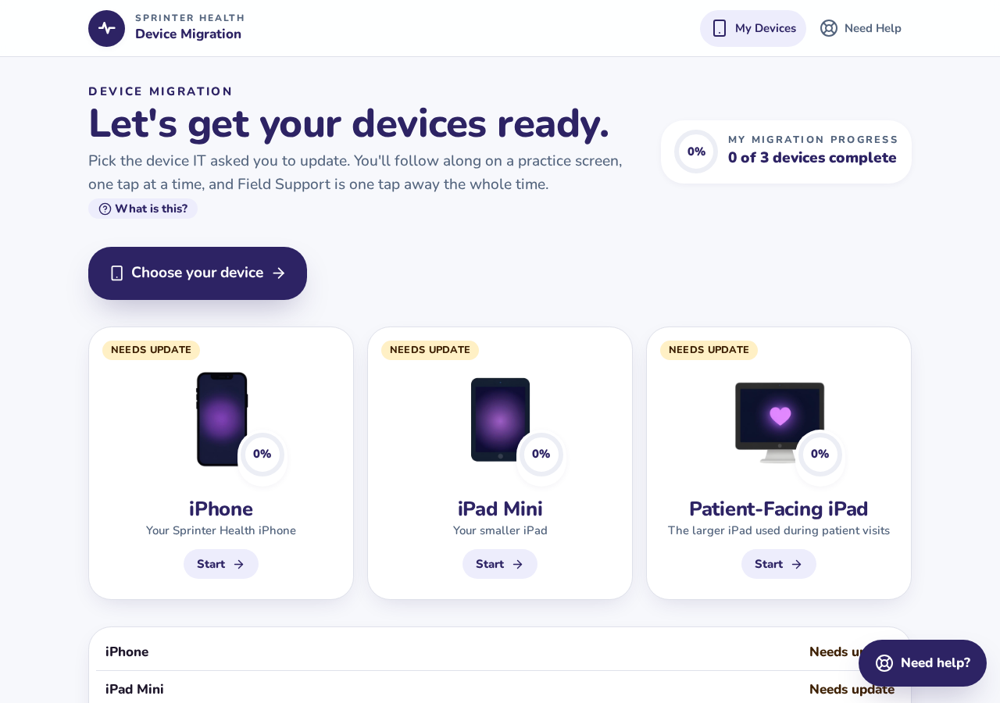
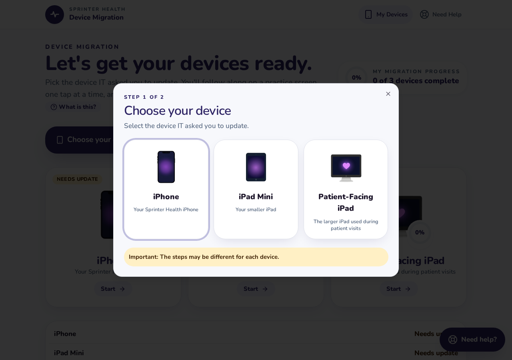
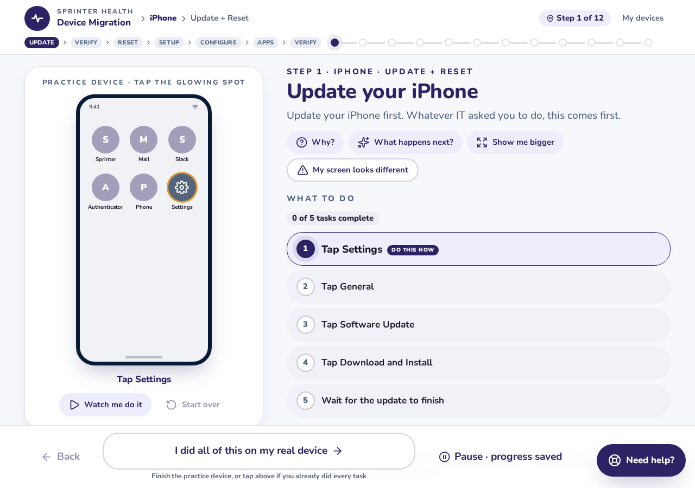
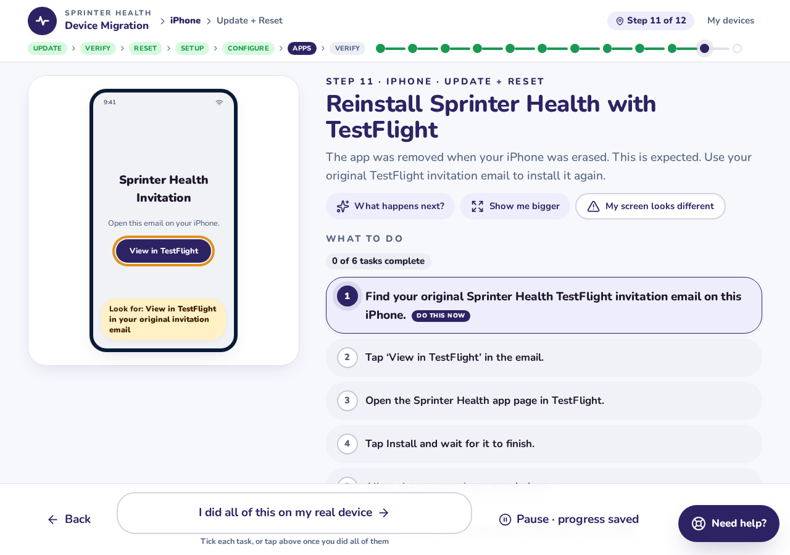
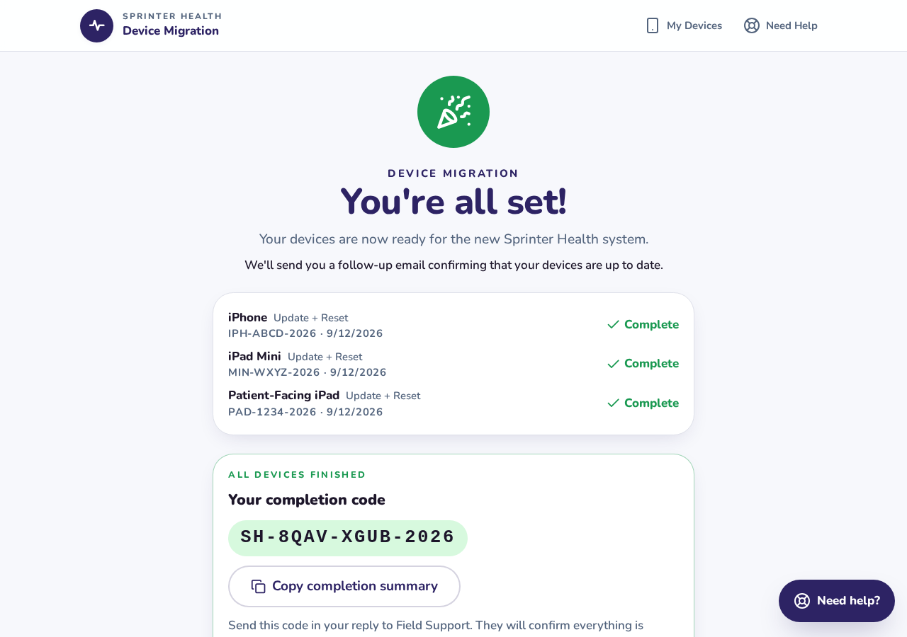
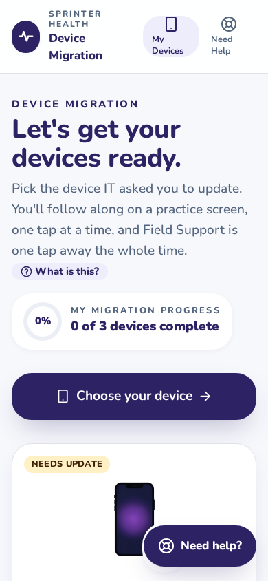

# Sprinter Health Device Migration Guide


A patient, step-by-step web guide that turns a technical device migration into a tap-along experience for non-technical field staff.

## What it is

Sprinter Health field staff use company-owned iPhones and iPads during patient visits. When IT needs those devices moved to a new management system, the instructions can feel intimidating to people who do not work with tech every day.

This guide walks each person through their specific device and IT-requested path (update only, or update + reset), one task at a time, on a friendly practice screen. Progress is saved automatically, so they can pause, refresh, or switch devices and always land exactly where they left off. Field Support is one tap away on every screen.

This repository is a **static demonstration prototype** built to validate the user experience before backend integrations are wired up.

## Key features

### Multi-device launcher

The home page shows every device IT may ask them to update: iPhone, iPad Mini, and Patient-Facing iPad. Each card explains what the device is and shows its current migration status.



### Smart device and path routing

A two-step chooser asks which device they were asked to update, then which action IT requested. The guide never assumes the path on its own.



### Tap-along practice device

Instead of reading a wall of text, the user practices each step on a simulated iPhone or iPad. Glowing targets show exactly what to tap, and a "Watch me do it" autoplay mode demonstrates the sequence first.



### TestFlight reinstall after erase

When a device has been erased or factory reset, the Sprinter Health app disappears. The guide explains this is expected and walks the user through reinstalling from the original TestFlight invitation email, with separate sections for normal install/update and post-erase reinstall.



### Persistent task checkpoints

Every task is a checkpoint. Completed tasks are ticked and grayed out; the current task is highlighted; upcoming tasks stay visible so the user always knows what is next. State lives in localStorage, so refresh or reopening the page resumes at the exact task in progress.

### Completion proof for Field Support

When a device finishes, it issues a readable confirmation code. Once every device is complete, a single master completion code is generated and can be copied into the Field Support ticket reply.



### Mobile-first responsive layout

The same flow works on a phone-sized screen, with stacked layouts and touch-friendly targets.



## Tech stack

- **Framework:** [TanStack Start](https://tanstack.com/start) (full-stack React, file-based routing, server functions)
- **UI library:** React 19
- **Language:** TypeScript 5
- **Styling:** Tailwind CSS v4 with CSS theme variables
- **Components:** Radix UI primitives + custom components
- **Motion:** Motion (Framer Motion successor)
- **Validation:** Zod
- **Persistence:** Browser localStorage
- **Build tool:** Vite

## Design and UX decisions

- **Never assume.** The app asks the user to confirm which device and which path IT requested.
- **One current task.** Checklists highlight exactly one active item so the user is never unsure what to do next.
- **Practice before pressure.** The simulator lets users rehearse taps without touching their real device.
- **Help is always visible.** A floating "Need help?" button opens a contextual support menu on every screen.
- **Plain language.** Copy is written at a sixth-grade reading level and avoids IT jargon.
- **Reset safety.** A hold-to-confirm gate appears before any erase step to reduce accidental resets.

## Run locally

```bash
# Install dependencies
bun install
# or: npm install

# Start the dev server
bun run dev
# or: npm run dev
```

Open `http://localhost:8080` in your browser.

## Project status

This is a frontend prototype. The following flows are implemented and working:

- Device chooser and update-only / update-reset path routing
- Step-by-step simulator for iPhone, iPad Mini, and Patient-Facing iPad
- Persistent task checkpoints across refresh
- TestFlight install/update and post-erase reinstall guidance
- Field Support menu, "I can't continue," and contextual help flows
- Per-device and master completion codes with copyable summary

No backend, database, messaging API, or real device management is connected. All data is stored locally in the browser for demonstration purposes.

## Prototype note

This project is intended to demonstrate the user experience and interaction patterns for stakeholders and future developers. Nothing in this repository transmits data to Sprinter Health systems, opens real support tickets, or performs actual device commands. Field Support verification, backend persistence, and integrations would be added in a production phase.
